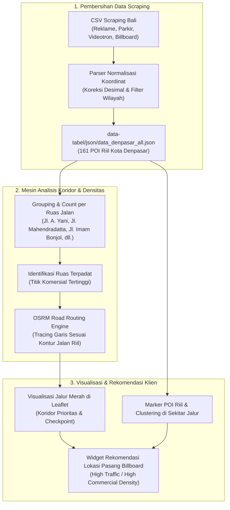
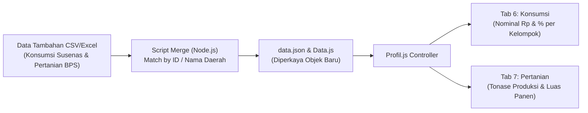

# Master Plan Integrasi Data: Peta Potensi Pajak (PAD360) & Profil Daerah BPS

| Dokumen | Master Planning Integrasi & Arsitektur Data |
| :--- | :--- |
| **Lokasi Proyek** | `c:\laragon\www\PKL\mockup` |
| **Dokumen Target** | `docs/PLANNING_INTEGRASI_DATA_POTENSI_DAN_PROFIL.md` |
| **Fokus Modul** | 1. Peta Potensi Pajak (PAD360 - Pilot Kota Denpasar)<br>2. Profil Daerah 9 Tab (Tab Konsumsi & Pertanian) |
| **Tanggal Pembuatan** | 09 Oktober 2026 |
| **Status** | Draf Perencanaan Teknis Terverifikasi |

---

## 1. Ringkasan Eksekutif & Latar Belakang

Sistem Portal Data saat ini memiliki dua modul utama yang membutuhkan integrasi data riil:
1. **Modul Peta Potensi Pajak Daerah (PAD360)**:
   * *Kondisi saat ini*: Menampilkan data POI sintetis dan garis rute koridor statis (tidak berbasis fakta lapangan).
   * *Kebutuhan baru*: Memanfaatkan data scraping riil (`data-tabel/json/`) untuk mendeteksi koridor ruas jalan terpadat secara otomatis ("Jalur Merah") guna memberikan analitik eksposur komersial dan rekomendasi titik pemasangan billboard baru bagi klien. Pilot project diprioritaskan untuk **Kota Denpasar**.
2. **Modul Profil Daerah (Dossier 9 Tab)**:
   * *Kondisi saat ini*: Tab 6 (**Konsumsi**) dan Tab 7 (**Data Pertanian**) pada `profil.html` hanya memuat placeholder statis teks `"BPS"` dan `"Terdata"` karena `data.json` dan `Data Kabupaten _ Kota Dalam Angka 2026 - DATA.csv` belum memiliki metrik detail Susenas dan Sensus Pertanian.
   * *Kebutuhan baru*: Merancang skema data, pipeline *merge*, dan visualisasi UI komparatif begitu data tabel lanjutan masuk.

---

## 2. Bagian I: Fitur Peta Potensi Pajak (PAD360) — Pilot Kota Denpasar



### 2.1. Audit & Evaluasi Data Scraping Denpasar Saat Ini
Berdasarkan hasil parsing dari folder `data-tabel/json/`, Kota Denpasar memiliki **161 titik POI riil tervalidasi**:
* **Reklame / Biro Iklan**: 116 titik (densitas tertinggi di Denpasar Barat dan Denpasar Selatan).
* **Fasilitas Parkiran**: 42 titik (kantong parkir ruko, gedung, pelataran komersial).
* **Videotron Digital**: 3 titik (LED megatron berizin aktif).
* **Billboard Tiang**: Titik sebaran tambahan dari data hasil scraping lanjutan.

> [!WARNING]
> **Keterbatasan Karakteristik Data Scraping:**
> Sebagian besar data scraping Google Maps dengan keyword "reklame" adalah **toko fisik/kantor biro iklan/percetakan**, bukan tiang billboard fisik di median jalan. 
> *Solusi:* Sistem memperlakukan sebaran toko reklame, videotron, dan parkiran ini sebagai **Indikator Aktivitas Komersial (*Commercial Density Proxy*)**. Ruas jalan dengan konsentrasi tinggi toko reklame dan parkir terbukti merupakan pusat bisnis strategis.

### 2.2. Algoritma Penentuan "Jalur Merah" (Automatic Corridor Ranking)
Jalur koridor merah **tidak lagi digambar statis**, melainkan ditentukan secara dinamis melalui formula:

$$\text{Commercial Density Score} = (N_{\text{reklame}} \times 1.0) + (N_{\text{videotron}} \times 2.5) + (N_{\text{parkir}} \times 1.5)$$

1. **Top 5 Ruas Jalan Terpadat di Kota Denpasar**:
   * Peringkat 1: **Jl. Ahmad Yani Utara** (6 titik POI komersial)
   * Peringkat 2: **Jl. Mahendradatta** (4 titik POI komersial)
   * Peringkat 3: **Jl. Imam Bonjol** (4 titik POI komersial)
   * Peringkat 4: **Jl. Tukad Balian** (3 titik POI komersial)
   * Peringkat 5: **Jl. Gunung Agung** (3 titik POI komersial)
2. **Pemilihan Koridor Prioritas**:
   * Sistem memilih ruas peringkat tertinggi sebagai **"Koridor Utama Aktif"** (garis merah pekat dengan polyline OSRM).
   * Ruas terpadat lainnya ditampilkan sebagai **"Koridor Sekunder"** (garis putus-putus/oranye).

### 2.3. Integrasi OSRM & Penataan Checkpoint
* Mengambil koordinat ujung awal dan ujung akhir ruas jalan terpilih.
* Menembak OSRM Routing API (`router.project-osrm.org`) untuk mendapatkan polyline akurat mengikuti tikungan dan persimpangan jalan riil.
* Checkpoint (01, 02, 03, 04) otomatis di-snap pada titik-titik persimpangan utama atau POI videotron sepanjang koridor tersebut.

### 2.4. Fitur Rekomendasi Lokasi Pasang Billboard bagi Klien
Pada panel kontrol samping (Sidebar Potensi), ditambahkan kartu analitik khusus klien pengiklan:
* **Status Koridor**: `Kepadatan Komersial: Sangat Tinggi (Tier 1)`
* **Estimasi Eksposur**: Indikasi potensi lalu lintas harian berbasis jumlah kantong parkir & videotron yang aktif.
* **Slot Rekomendasi**: Rekomendasi penempatan billboard baru di titik koordinat persimpangan jalan yang minim kompetitor billboard namun berada di koridor padat.

---

## 3. Bagian II: Fitur Profil Daerah — Tab Konsumsi & Pertanian



### 3.1. Identifikasi Celah Data Saat Ini
* **Tab 6 (Konsumsi)**: Saat ini fungsi `renderKonsumsi()` di [Profil.js](file:///c:/laragon/www/PKL/mockup/Profil.js#L1160) hanya merender 14 kotak dengan tulisan statis `BPS`.
* **Tab 7 (Data Pertanian)**: Saat ini fungsi `renderPertanian()` di [Profil.js](file:///c:/laragon/www/PKL/mockup/Profil.js#L1180) hanya merender 4 kotak dengan tulisan statis `Terdata`.

### 3.2. Spesifikasi Skema Data yang Diharapkan

#### A. Skema Data Konsumsi (14 Kelompok Susenas BPS)
Setiap wilayah pada `data.json` akan ditambahkan properti `konsumsi`:
```json
"konsumsi": {
  "pengeluaran_total_bulan": 1850000,
  "komoditas": [
    { "key": "padi", "label": "Padi-Padian", "nilai_rp": 125000, "persen": 6.8 },
    { "key": "umbi", "label": "Umbi-Umbian", "nilai_rp": 22000, "persen": 1.2 },
    { "key": "ikan", "label": "Ikan-Ikanan", "nilai_rp": 145000, "persen": 7.8 },
    { "key": "daging", "label": "Daging", "nilai_rp": 110000, "persen": 5.9 },
    { "key": "telur_susu", "label": "Telur & Susu", "nilai_rp": 85000, "persen": 4.6 },
    { "key": "sayur", "label": "Sayur-Sayuran", "nilai_rp": 95000, "persen": 5.1 },
    { "key": "kacang", "label": "Kacang-Kacangan", "nilai_rp": 42000, "persen": 2.3 },
    { "key": "buah", "label": "Buah-Buahan", "nilai_rp": 78000, "persen": 4.2 },
    { "key": "minyak", "label": "Minyak & Kelapa", "nilai_rp": 48000, "persen": 2.6 },
    { "key": "minuman", "label": "Bahan Minuman", "nilai_rp": 55000, "persen": 3.0 },
    { "key": "bumbu", "label": "Bumbu-Bumbuan", "nilai_rp": 38000, "persen": 2.1 },
    { "key": "bahan_lain", "label": "Bahan Makanan", "nilai_rp": 32000, "persen": 1.7 },
    { "key": "makanan_jadi", "label": "Makanan Jadi", "nilai_rp": 620000, "persen": 33.5 },
    { "key": "rokok", "label": "Rokok & Tembakau", "nilai_rp": 355000, "persen": 19.2 }
  ]
}
```

#### B. Skema Data Pertanian (4 Subsektor Produksi BPS)
Setiap wilayah pada `data.json` akan ditambahkan properti `pertanian`:
```json
"pertanian": {
  "tanaman_pangan": {
    "total_ton": 32500,
    "luas_panen_ha": 6200,
    "komoditas_utama": "Padi Sawah (28.400 Ton), Jagung (4.100 Ton)"
  },
  "hortikultura": {
    "total_ton": 14200,
    "komoditas_utama": "Cabai Rawit (5.200 Ton), Bawang Merah (3.800 Ton)"
  },
  "perkebunan": {
    "total_ton": 8900,
    "komoditas_utama": "Kelapa (6.100 Ton), Kopi Robusta (2.800 Ton)"
  },
  "peternakan": {
    "populasi_ekor": 185000,
    "komoditas_utama": "Ayam Pedaging (140.000 Ekor), Babi (32.000 Ekor), Sapi Bali (13.000 Ekor)"
  }
}
```

### 3.3. Pembaruan Desain Tampilan UI di [Profil.js](file:///c:/laragon/www/PKL/mockup/Profil.js)

1. **Tab Konsumsi**:
   * Kartu 14 komoditas tidak lagi bertuliskan `"BPS"`, melainkan memunculkan angka riil:
     * Nilai pengeluaran bulanan (contoh: `Rp125.000/bln`).
     * Mini persentase bar (contoh: `6.8% dari total pengeluaran`).
   * Ditambahkan KPI Card di bagian atas: **Total Pengeluaran Makanan vs Non-Makanan** dan **Rasio Pengeluaran Rokok/Tembakau**.
2. **Tab Data Pertanian**:
   * Kartu 4 sektor tidak lagi bertuliskan `"Terdata"`, melainkan:
     * Angka volume total panen (`32.500 Ton / th` atau populasi ternak).
     * Tag komoditas unggulan daerah tersebut.
   * Ditambahkan visualisasi komparasi luas lahan panen terhadap luas wilayah total.

---

## 4. Matriks Risiko, Keterbatasan Data, & Mitigasi Teknis

| Risiko / Keterbatasan | Dampak | Strategi Mitigasi Teknis |
| :--- | :--- | :--- |
| **Bias Scraping (Toko vs Tiang Reklame)** | Klien bisa salah paham mengira marker toko adalah fisik baliho di jalan. | Beri pembeda badge/label jelas di detail marker: `Kategori: Kantor / Agensi Advertising (Penyedia Jasa)` vs `Kategori: Fisik Tiang Billboard / LED`. |
| **Data Scraping Baru Format Berantakan** | Parsing koordinat gagal atau nilai null. | Selalu jalankan pipeline validasi `scripts/convert_csv_to_json.js` dengan boundary box filter sebelum data disuntikkan ke frontend. |
| **Kelengkapan 514 Daerah untuk Konsumsi/Pertanian** | Data baru mungkin hanya mencakup Bali atau belum mencakup seluruh 514 kabupaten/kota. | Pasang strategi *fallback gracefully* di `Profil.js`: Jika data detail belum ada untuk wilayah tertentu, tampilkan indikator `"Data sensus sedang dikompilasi"` alih-alih merusak tampilan layout. |
| **Ukuran Bundle Skrip Frontend** | Memasukkan seluruh data mentah memperlambat loading browser. | Pisahkan data riil POI Denpasar ke file khusus `denpasar-poi.js` atau load secara dinamis saat user memilih Kota Denpasar. |

---

## 5. Rencana Tahapan Eksekusi (Action Items)

```
[ ] SPRINT 1: ENGINE JALUR RAMAI DENPASAR (PETA POTENSI)
    [x] Tahap 1.1: Konversi 4 file CSV scraping ke JSON & normalisasi koordinat.
    [x] Tahap 1.2: Pembersihan 18 data noise luar Bali & konsolidasi 161 POI Denpasar.
    [ ] Tahap 1.3: Buat script penghitung densitas POI per ruas jalan di Denpasar.
    [ ] Tahap 1.4: Update potensi.js agar jalur koridor merah Kota Denpasar otomatis mengikuti Jl. Ahmad Yani / Jl. Imam Bonjol (rute terpadat).
    [ ] Tahap 1.5: Tampilkan 161 titik POI riil scraping di Leaflet saat Denpasar dibuka, lengkap dengan OSRM polyline.
    [ ] Tahap 1.6: Tambahkan kartu rekomendasi klien: "Zona Rekomendasi Pemasangan Billboard (Traffic Tinggi)".

[ ] SPRINT 2: INTEGRASI DATA TAB KONSUMSI & PERTANIAN (PROFIL DAERAH)
    [ ] Tahap 2.1: Penerimaan dataset CSV/Excel baru dari user.
    [ ] Tahap 2.2: Buat script ETL merge dataset ke data.json & Data.js.
    [ ] Tahap 2.3: Perbarui fungsi renderKonsumsi(r) di Profil.js (tampilkan nominal Rp & % pengeluaran).
    [ ] Tahap 2.4: Perbarui fungsi renderPertanian(r) di Profil.js (tampilkan volume tonase panen & komoditas utama).
    [ ] Tahap 2.5: Verifikasi visual responsive di halaman profil.html (Denpasar dan kabupaten lainnya).
```

---

Dokumen ini menjadi acuan kerja utama untuk proses koding dan integrasi data selanjutnya.
