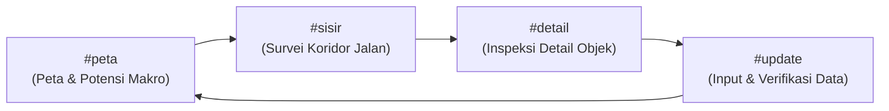
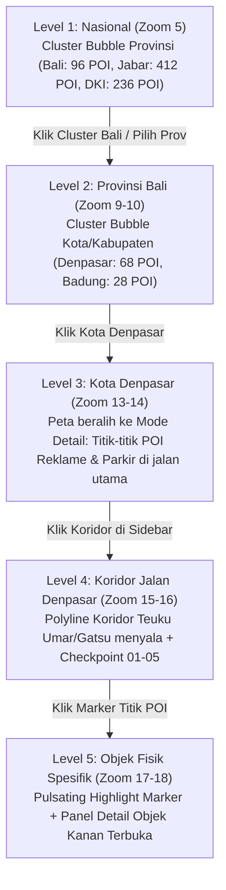
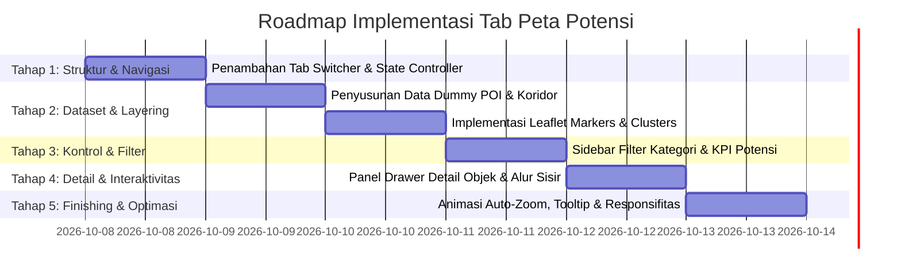

# Perencanaan Pengembangan: Tab Peta Potensi Pajak (PAD360)

| Dokumen | Perencanaan Arsitektur & Implementasi |
| :--- | :--- |
| **Lokasi Proyek** | `C:\laragon\www\PKL\mockup` |
| **Target URL** | [Portal Data Indonesia](https://mockup-indonesia-data-portal.vercel.app/?view=map) |
| **Referensi Desain** | `Referensi/PAD360 Peta Potensi Pajak.html` |
| **Tanggal Penyusunan** | 07 Oktober 2026 |
| **Status** | Draf Perencanaan Terverifikasi |

---

## 1. Ringkasan Eksekutif & Prinsip Isolasi Fitur

### 1.1. Arsitektur Dual Switch di Header (Pojok Kanan Atas)
Sistem memisahkan antara **Mode Data Peta** dengan **Tipe Tampilan**:
* **Saat Tampilan Peta Aktif**: Muncul 2 switch berdampingan:
  `[ 🏛️ Profil | 📍 Potensi ]` (Switch Mode Data) dan `[ 🗺️ Peta | 📊 Tabel Peringkat ]` (Switch Tampilan).
* **Saat Tampilan Tabel Aktif**: Switch Mode `[ 🏛️ Profil | 📍 Potensi ]` **otomatis disembunyikan/hilang** agar header tetap bersih dan fokus pada tabel perbandingan 514 daerah.
* **Dashboard Utama Tetap Utuh**: Mode Profil (`view=map` & `view=table`) 100% menggunakan logika dan komponen yang sudah ada tanpa perubahan.

### 1.2. Tujuan Penambahan Mode Potensi
Mengintegrasikan visualisasi titik aset/objek pajak daerah (*Point of Interest / POI*), koridor penyisiran (*ground truthing*), analitik indikasi potensi finansial (Pajak Reklame, PBJT Parkir, PBB-P2), serta panel inspeksi detail objek berbasis bukti lapangan.

Modul ini memadukan visualisasi geografis berbasis titik/titik klaster (*Point of Interest / POI*), analitik indikasi potensi pajak (Pajak Reklame, PBJT Parkir, PBB-P2), serta panel inspeksi detail objek berbasis bukti lapangan.

---

## 2. Analisis Kritis & Dekonstruksi Fitur Referensi

Berdasarkan telaah mendalam terhadap file referensi [`PAD360 Peta Potensi Pajak.html`](file:///C:/laragon/www/PKL/mockup/Referensi/PAD360%20Peta%20Potensi%20Pajak.html), terdapat 4 bagian penting:



### 2.1. Penjelasan Masing-Masing Modul Referensi

| Modul Referensi | Deskripsi & Peran Fungsional | Penerapan pada Portal Baru |
| :--- | :--- | :--- |
| **`#peta` (Peta Potensi)** | Menampilkan sebaran potensi pajak per wilayah (Nasional $\rightarrow$ Provinsi $\rightarrow$ Kabupaten/Kota), metrik KPI (Potensi Indikatif, Perlu Verifikasi), dan filter kategori POI. | **Sidebar Kiri + Peta Tengah**: Menjadi tampilan default saat tab "Peta Potensi" dibuka. |
| **`#detail` (Detail Objek)** | Menampilkan metadata lengkap satu objek fisik: foto bukti, dimensi ($p \times l$), register pajak, status izin, estimasi nilai sewa reklame / tarif parkir, dan riwayat observasi. | **Panel Drawer Kanan**: Terbuka saat pengguna mengeklik salah satu marker titik di peta atau memilih item di list. |
| **`#sisir` (Sisir Jalan)** | *Field Survey Workflow*: Petugas lapangan menyusuri koridor jalan tertentu dengan titik-titik *checkpoint* (1, 2, 3...) untuk memvalidasi keberadaan fisik objek di lapangan dengan register Bapenda. | **Sub-Mode Koridor Terpadu**: Diaktifkan saat pengguna memilih salah satu koridor jalan prioritas (contoh: *Koridor A - Bandung*). |
| **`#update` (Aplikasi Lapangan)** | Formulir pencatatan bukti lapangan (foto, koordinat GPS, input dimensi) dan alur persetujuan verifier (*approval queue*). | **Opsional / Tahap Lanjutan**: Formulir simulasi inspeksi dan pengajuan revisi data objek. |

---

## 3. Desain Arsitektur & Tata Letak (Layout)

Tata letak akan memanfaatkan struktur split-screen 3 kolom adaptif yang selaras dengan arsitektur portal utama:

```
+---------------------------------------------------------------------------------------------------------+
|  [Logo] Portal Data Indonesia       [ Cari Wilayah / Objek... ]       [ Peta | Tabel | Peta Potensi ]   |
+------------------------------------+---------------------------------------------+----------------------+
| SIDEBAR KIRI (KONTROL POTENSI)     | WORKSPACE TENGAH (LEAFLET INTERAKTIF)       | PANEL DETAIL KANAN   |
|                                    |                                             |                      |
| 1. Hierarki Wilayah                | - Leaflet Map Canvas                        | - Foto Objek/Mockup  |
|    - Pilih Provinsi & Kab/Kota     | - Layer 1: Poligon Batas Daerah             | - Identitas Objek    |
|                                    | - Layer 2: Cluster & Marker Titik POI       |   (Dimensi, Pemilik) |
| 2. Filter Kategori POI             | - Layer 3: Polyline Rute Koridor Sisir      | - Status Register    |
|    - Reklame, Parkir, Mall, PBB    | - Auto-zoom & FlyTo animasi                 |   dan Izin Usaha     |
|                                    | - Tooltip ringkas saat hover titik          | - Estimasi Nilai     |
| 3. Ringkasan KPI Potensi           | - Legenda Kategori & Status Titik           | - 6 Tahap Alur Kasus |
|    - Potensi Indikatif (Rp M)      |                                             | - Objek Terkait di   |
|    - Objek Perlu Verifikasi        |                                             |   Lokasi yang Sama   |
|                                    |                                             |                      |
| 4. Antrean Koridor Prioritas       |                                             |                      |
|    - Daftar koridor jalan          |                                             |                      |
|    - Tombol "Mulai Mode Sisir"     |                                             |                      |
+------------------------------------+---------------------------------------------+----------------------+
```

---

## 4. Mekanisme Fitur & Alur Interaksi

### 4.1. Konsep Satu Kanvas Peta (Single Map Instance with Dynamic Layer Switching)
Peta di tab "Peta Interaktif" dan tab "Peta Potensi" **menggunakan kanvas peta Leaflet (`#map`) yang sama persis** (tidak dibuat terpisah/terduplikasi). Yang berganti hanyalah **layer data yang divisualisasikan**:

* **Saat di Tab "Peta Interaktif" (`view=map`)**:
  - Menampilkan: Layer **Choropleth Poligon 514 Kab/Kota** (berwarna sesuai metrik Kependudukan, IPM, PDRB, Kemiskinan).
  - Menyembunyikan: Layer titik POI & koridor potensi.
  - Sidebar: Kontrol metrik statistik tematik.

* **Saat di Tab "Peta Potensi" (`view=potensi`)**:
  - Menampilkan: Layer **Titik POI / Cluster Potensi Pajak** (Marker Reklame, Parkir, Mall, PBB) dan **Polyline Rute Koridor**.
  - Menyembunyikan: Layer pewarnaan choropleth statistik daerah.
  - Interaksi: Auto-zoom (`map.flyTo` / `map.flyToBounds`) saat klik wilayah/marker titik POI untuk membuka panel detail objek di sebelah kanan.
  - Sidebar: Kontrol kategori POI, filter status verifikasi, dan metrik indikasi potensi finansial (Rp).

### 4.2. Hierarki 5 Tingkat Auto-Zoom & Perilaku Titik (Showcase Pilot: Kota Denpasar, Bali)

Visualisasi titik dirancang adaptif berdasarkan level zoom dengan Kota Denpasar (Bali) sebagai percontohan utama:



| Tingkat Zoom | Level Tampilan | Visualisasi di Peta | Aksi & Transisi Interaktif |
| :--- | :--- | :--- | :--- |
| **Zoom 5** | **Nasional** | Gelembung klaster (*Cluster Bubbles*) jumlah POI per provinsi (misal: *Bali: 96 POI, Jabar: 412 POI*). | Klik klaster Bali $\rightarrow$ `map.flyToBounds()` meluncur ke Provinsi Bali. |
| **Zoom 9–10** | **Provinsi Bali** | Klaster tingkat Kabupaten/Kota (misal: *Kota Denpasar: 68 POI, Kab. Badung: 28 POI*). | Klik klaster Kota Denpasar $\rightarrow$ Auto-zoom meluncur ke batas Kota Denpasar. |
| **Zoom 13–14** | **Kota Denpasar** *(Pilot Showcase)* | Peta berganti ke **Mode Detail Jalan**: Klaster pecah menjadi **titik-titik POI fisik individual** (Billboard di Jl. Teuku Umar, Parkir di Jl. Gatsu, Hotel/Mall di Sanur) dengan status verifikasi. | Titik-titik POI muncul dengan warna kategori/status. Tooltip aktif saat di-hover. |
| **Zoom 15–16** | **Koridor Jalan Denpasar** *(contoh: Koridor Teuku Umar)* | Garis polyline rute jalan disorot (*glow effect*), muncul lingkaran nomor *Checkpoint 01 s/d 05*. | Klik salah satu checkpoint $\rightarrow$ menampilkan popup temuan/objek di ruas tersebut. |
| **Zoom 17–18** | **Objek Fisik Spesifik** | Titik POI diperbesar, marker berdenyut (*pulsating glow*), peta fokus ke koordinat objek. | Otomatis membuka **Panel Detail Objek** di sebelah kanan (Foto, Dimensi $6 \times 4\text{ m}$, Register vs Izin). |

### 4.3. Rute Koridor Pilot Kota Denpasar
1. **Koridor A - Jl. Teuku Umar (2,8 km)**: Fokus Pajak Reklame komersial, billboard toko, dan perparkiran tepi jalan (Tim Lapangan 1).
2. **Koridor B - Jl. Gatot Subroto (3,4 km)**: Fokus Billboard videotron, reklame bando jalan, dan kantong parkir swasta (Tim Lapangan 2).
3. **Koridor C - Kawasan Sanur / By Pass Ngurah Rai (4,1 km)**: Fokus reklame perhotelan, mall/pusat belanja, dan PBJT (Tim Lapangan 3).

### 4.4. Tombol Reset / Breadcrumb Navigasi Zoom
Untuk memudahkan pengguna kembali ke level atas, disediakan kontrol navigasi cepat:
* **Breadcrumbs Interaktif** di atas peta / sidebar: `Nasional` > `Bali` > `Kota Denpasar` > `Koridor Teuku Umar`.
* Mengklik breadcrumb level atas akan otomatis memicu `map.flyToBounds()` kembali ke cakupan wilayah tersebut.

---

## 5. Struktur Data (Data Schema)

Dataset dummy terstruktur akan disiapkan pada script frontend untuk mendukung interaktivitas tanpa backend eksternal:

```javascript
// Contoh Struktur Objek POI Potensi
{
  id: "OBJ-RKL-001",
  name: "REKLAME A - Simpang Djuanda",
  category: "rek", // rek, pkr, mall, pab, tmn
  taxType: "reklame",
  status: "ver", // ver (perlu verifikasi), val (tervalidasi), baru (kandidat baru)
  lat: -6.9024,
  lng: 107.6186,
  cityId: "bdg",
  cityName: "Kota Bandung",
  corridor: "A",
  checkpoint: "02",
  physical: {
    width: 6,
    height: 4,
    area: 24,
    sides: 1,
    type: "Papan Reklame Bilboard",
    owner: "PT Contoh Media Visual",
    operator: "Operator Media Utama",
    period: "12 Bulan"
  },
  taxCompliance: {
    businessLicense: "Belum diverifikasi",
    taxRegisterStatus: "Perlu pencocokan",
    taxBaseFormula: "Nilai Sewa Reklame × Tarif Daerah",
    estimatedAnnualPotential: 85000000
  },
  workflowStage: 2, // 0..5
  observations: [
    { date: "14 Sep 2026", note: "Ditemukan pada checkpoint 02, tugas SRV-017", by: "Tim Lapangan 1 (Akurasi GPS ±4m)" }
  ]
}
```

---

## 6. Rencana Tahapan Eksekusi (Implementation Phases)



### Rincian Tiap Fase:
1. **Fase 1: Antarmuka Switcher & Pengatur Tampilan**:
   - Menambahkan tombol `#btnViewPotensi` pada `.view-switcher` di [`index.html`](file:///C:/laragon/www/PKL/mockup/index.html).
   - Sinkronisasi URL query string (`?view=potensi`).
2. **Fase 2: Visualisasi Geografis Leaflet**:
   - Menambahkan layer group Leaflet untuk titik POI, cluster ikon, dan rute polyline koridor jalan.
   - Integrasi event klik marker dengan animasi zoom `flyTo`.
3. **Fase 3: Sidebar Khusus Potensi**:
   - Menampilkan ringkasan metrik finansial (Potensi Indikatif vs Realisasi).
   - Menyediakan filter multi-kategori (Billboard, Parkir, Mall, Pabrik).
4. **Fase 4: Panel Drawer Detail Objek**:
   - Mengadaptasi layout kartu informasi, status izin, perbandingan data fisik vs register, dan stepper tahapan validasi.
5. **Fase 5: Pengujian & Validasi Lintas Perangkat**:
   - Pengujian performa render marker pada resolusi desktop dan mobile.

---

## 7. Rekomendasi & Langkah Selanjutnya

1. **Review Dokumen**: Pastikan struktur alur di atas sesuai dengan ekspektasi arahan pimpinan.
2. **Persetujuan Scope**: Konfirmasi apakah modul `#update` (formulir simulasi foto & verifier approval) perlu dimasukkan secara interaktif di tahap pertama atau difokuskan pada visualisasi `#peta` + `#sisir` + `#detail`.
3. **Mulai Implementasi**: Menjalankan Fase 1 dan Fase 2 pada kode sumber utama ([`index.html`](file:///C:/laragon/www/PKL/mockup/index.html) dan [`Map.js`](file:///C:/laragon/www/PKL/mockup/Map.js)).
